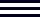

# Frontend Mentor - News homepage solution

This is a solution to the [News homepage challenge on Frontend Mentor](https://www.frontendmentor.io/challenges/news-homepage-H6SWTa1MFl). Frontend Mentor challenges help you improve your coding skills by building realistic projects. 

## Table of contents

- [Overview](#overview)
  - [The challenge](#the-challenge)
  - [Screenshot](#screenshot)
  - [Links](#links)
- [My process](#my-process)
  - [Built with](#built-with)
  - [What I learned](#what-i-learned)
  - [Continued development](#continued-development)
  - [Useful resources](#useful-resources)
  - [AI Collaboration](#ai-collaboration)
- [Author](#author)
- [Acknowledgments](#acknowledgments)


## Overview

### The challenge

Users should be able to:

- View the optimal layout for the interface depending on their device's screen size
- See hover and focus states for all interactive elements on the page

### Screenshot


### Links

- Solution URL: [New Homepage - GitHub directory](https://github.com/MartheAudrey/Frontend-Mentor/tree/main/news-homepage-main)
- Live Site URL: [Add live site URL here](https://your-live-site-url.com)

## My process

### Built with

- Semantic HTML5 markup
- CSS custom properties
- Flexbox
- CSS Grid
- Mobile-first workflow


### What I learned

This project gave me the opportunity to learn how to build resposive navigation using CSS and JavaScript.

Based on the screen's width, the layout switches from the mobile header to the desktop header.

```html
  <header>
    <div class="logo-container">
      
    </div>
    <nav class="nav-links">
      <ul>
        <li><a href="#">Home</a></li>
        <li><a href="#">New</a></li>
        <li><a href="#">Popular</a></li>
        <li><a href="#">Trending</a></li>
        <li><a href="#">Categories</a></li>
      </ul>
    </nav>
    <button class="hamburger" aria-label="Toggle menu" aria-expanded="false" onclick="showSidebar()">
      
    </button>
  </header>

  <sidebar class="sidebar">
    <button class="xmark" aria-label="Close menu" onclick="hideSidebar()">
      
    </button>
    <div class="sidebar-navigation">
      <ul>
        <li><a href="#">Home</a></li>
        <li><a href="#">New</a></li>
        <li><a href="#">Popular</a></li>
        <li><a href="#">Trending</a></li>
        <li><a href="#">Categories</a></li>
      </ul>
    </div>
  </sidebar>

```

```css
  header{
    padding-block: var(--space1);
    display: flex;
    justify-content: space-between;
    align-items: center;
    margin-bottom: var(--space3);
  }

  .nav-links{
    display: none;
    transition: display 0.3s ease;
  }

  .sidebar{
    display: none;
    position: absolute;
    top: 0;
    right: 0;
    padding: var(--space4) var(--space3);
    background-color: var(--off-white);
    width: 70%;
    height: 100vh;
    transition: display 0.3s ease;
  }

  @media (min-width: 43.75rem){
    .hamburger{
        display: none;
    }

    .nav-links{
        display: block;
    }
  }
```

```js
  const showSidebar = () => {
      sidebar[0].style.display = 'block';
      body.style.backgroundColor = 'hsl(233, 8%, 79%)';
  };

  const hideSidebar = () => {
      sidebar[0].style.display = 'none';
      body.style.backgroundColor = 'hsl(36, 100%, 99%)';
  }
```

### Continued development

- JavaScript
- Accessibility
- Writing clean and maintanaible code
- best practices


### Useful resources

- [CSS font-weight Property - W3 Schools](https://www.w3schools.com/cssref/pr_font_weight.php) - This helped to recall how to define the font weight using keywords instead of numbers.
- [CSS Custom Fonts - W3 Schools](https://www.example.com) - It helped to remind myself of how to define and load  a custom font.

### AI Collaboration

To complete this challenge I used Claude AI for debugging.

## Author

- Frontend Mentor - [@MartheAudrey](https://www.frontendmentor.io/profile/MartheAudrey)

## Acknowledgments

- [News-Homepage Solution by Tonye Hugo Onuoha](https://www.frontendmentor.io/solutions/news-homepage-solution-VZZJUu1yNf)


